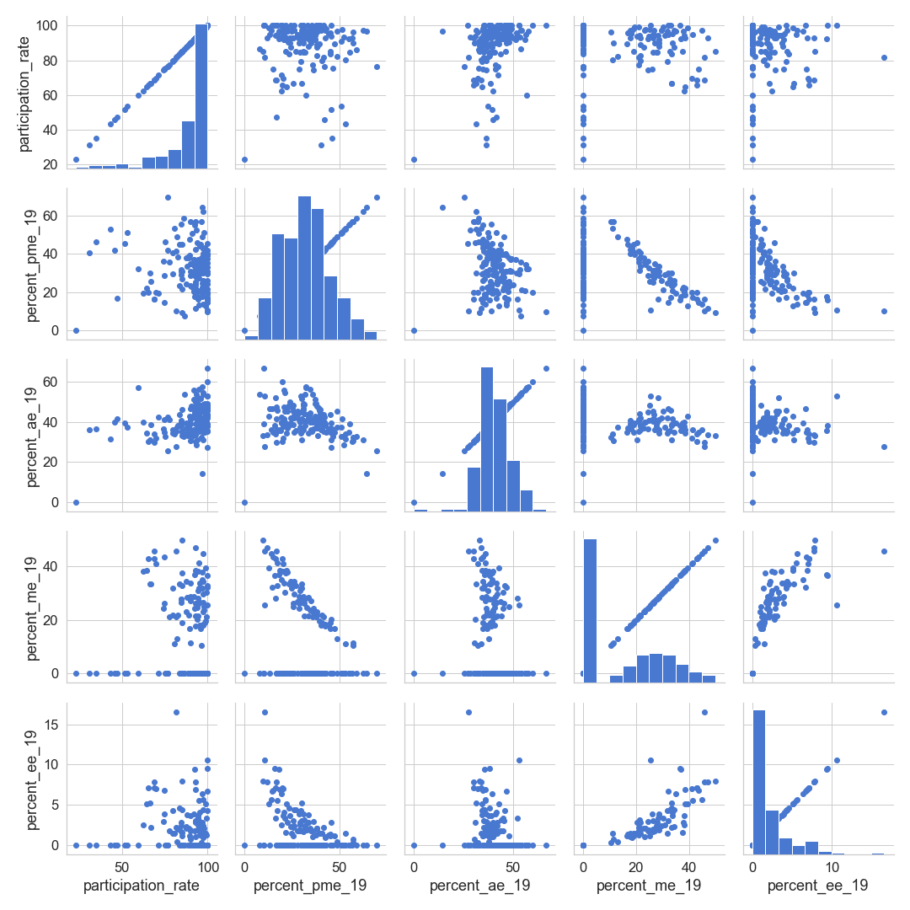

# 2019 District Level Science CMAS Data EDA

## Background and Motivation
Each spring, students from around Colorado sit in silent classrooms; taking standardized tests for hours, days on end, over several weeks. These tests are created in a collaboration between the Colorado Department of Education (CDE), Pearson Learning, and educators. Students test on Math and English Language arts every year, and Science in grades 5, 8, and 11. The results come back usually by late Summer, and then 'data dives' into their schools' scores are part of a teacher's professional development week before students return. 

How a school performs on these tests affects how they are [graded by the CDE](https://www.cde.state.co.us/accountability/2019-framework-scoring-guide_080319). Schools that continuously fail to meet certain benchmarks can be in danger of being [shut down](https://co.chalkbeat.org/2020/1/9/21109391/state-delays-final-decision-on-hope-online-but-steers-away-from-closure) or intervention from the state. The overall performance of a school is one of the metrics that is used to evaluate principals, which they then use to strategize how to run their schools.

    

**Personal bias:** I have taught in mainly low-performing schools. My very first year teaching was in a school that was being phased out due to its low performance. It is difficult to get buy-in from the students to perform well when there is no actual application to their life. How can I tell Student X that this is important to him? I know it isn't. It's important to my boss, who then makes it important in my life. 

## Data
The CDE releases the yearly results on their [website](https://www.cde.state.co.us/assessment/cmas-dataandresults-2019). I downloaded the 2019 CMAS Science District and School Overall Results in an excel file.

*Snapshot of the School District Level data:*

    

The original dataset has more than 4,700 rows of data on State, District, and School level data. Certain data was obsurced using '< 16' or '- -' for student privacy if there were less than 16 values. Most of the records include information such as:
* Participation Rate
* Mean Scale Score for 2019 and 2018
* Number and Percentage of Scores in each of the following categories:
    * Partially Met Expectations
    * Approached Expectations
    * Met Expectations
    * Exceeded Expectations
    * Met or Exceeded Expectations
* Change in Percent Met or Exceeded Expectations from 2018 to 2019

# Exploratory Data Analysis
## Looking for patterns in the data
To get an idea if there were any correlations between participation rate and the different test scores, I did a PairPlot Analysis. Since four of the variables were related through them being percentages of the overall performance, I didn't really see anything that jumped out at me initially. 

    

## Participation Rate and Test Scores
Next, I set out to explore the relationship between a district's participation rate and their test scores. I set each district's All School Participation Rate against their Mean Scaled Score. In order to see clearly which districts were performing well, I set a horizontal line at the minimum overall score for the Met Expectations category.

    

